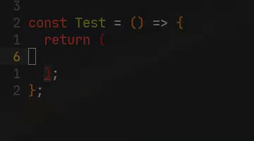

# Table of Contents

1.  [Web Mode And Rjsx Mode](#org2704bb3)

# Problem

## Web Mode Vs Rjsx Mode

I recently switched to emacs and instanly impressed by the extensiblity and on the other hand
overwhelmed by the options emacs has to offer. I mostly code in javscript and recently started
React js. Coming straight to the point emacs has a feature called mode for every type of file.
Like org-mode, prog-mode, js-mode etc. So I have to choose between web mode and rjsx mode for
editing jsx file. Rjsx mode is not very good with js file as i experienced but one thing i like 
about rjsx mode is the auto paring expansion which is different from emmet mode or web mode. 
So I wrote a auto pairing like rjsx mode for web mode myself.

> Mode can be changed manually. I didn't find a way to map the key bindings for web mode.

Featuers:

1. Easy expansion doesn't break your flow.
2. Smart enough so it will not expand in unexptected area like less than or greater than expression.

